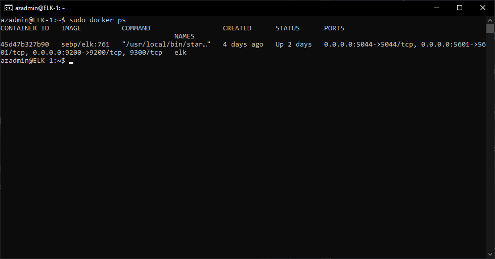

## Automated ELK Stack Deployment

The files in this repository were used to configure the network depicted below.


These files have been tested and used to generate a live ELK deployment on Azure. They can be used to either recreate the entire deployment pictured above. Alternatively, select portions of the playbook file may be used to install only certain pieces of it, such as Filebeat.

These are the Ansible Playbooks that were utilized to setup and configure the ELK Stack.
  - [pentest.yml](ansible/pentest.yml), designed to configure and setup DVWA (Damn Vulnerable Web Application) on a web server
  - [install-elk.yml](ansible/install-elk.yml), designed to setup the basic needs for an ELK server using Microsoft Azure Cloud resources
  - [filebeat-playbook.yml](ansible/filebeat-playbook.yml), designed to install and setup filebeat and metricbeat onto web VMs

This document contains the following details:
- Description of the Topologu
- Access Policies
- ELK Configuration
- Beats in Use
- Machines Being Monitored
- How to Use the Ansible Build


### Description of the Topology

The main purpose of this network is to expose a load-balanced and monitored instance of DVWA, the D*mn Vulnerable Web Application.

Load balancing ensures that the application will be highly available, in addition to restricting access to the network.
- The load balancer protects application availability by allowing client requests to be shared across multiple serves. It enhances the user experience by providing additional security and performance.
- A Jump Box is being utilized to minimize the attack surface by ensuring that remote connetions to the cloud network is handled through a single VM, Jump-Box-Provisioner in the diagram above.

Integrating an ELK server allows users to easily monitor the vulnerable VMs for changes to the configuration and system files.
- Filebeat is used to forward and centralize log data from the web server in conjunction with Kibana.
- Metricbeat is used to periodically collect metrics from the OS and services running on the web server in conjunction with Kibana.

The configuration details of each machine may be found below.

| Name                 | Function          | IP Address | Operating System     |
|----------------------|-------------------|------------|----------------------|
| Jump-Box-Provisioner | Gateway           | 10.1.0.4   | Linux (Ubuntu 20.04) |
| Web-1                | Web Server (DVWA) | 10.1.0.7   | Linux (Ubuntu 20.04) |
| Web-2                | Web Server (DVWA) | 10.1.0.6   | Linux (Ubuntu 20.04) |
| Web-3                | Web Server (DVWA) | 10.1.0.5   | Linux (Ubuntu 20.04) |
| ELK-1                | ELK Server        | 10.2.0.4   | Linux (Ubuntu 20.04) |

### Access Policies

The machines on the internal network are not exposed to the public Internet. As an measure of security the Web servers and ELK server can only be accessed using a public key from the Ansible Docker container. This will block any ssh traffic that does not match that key. 

Only the Jump Box machine can accept connections from the Internet. Access to this machine is only allowed from the following IP addresses:
- 198.54.107.182

Machines within the network can only be accessed by the Jump Box.
-  Jump-Box-Provisioner can access ELK-1 the ELK server using SSH and key verification. 

A summary of the access policies in place can be found in the table below.

| Name                 | Publicly Accessible | Allowed IP Addresses    | Allowed Ports |
|----------------------|---------------------|-------------------------|---------------|
| Jump-Box-Provisioner | Yes (SSH)           | 198.54.107.182          | 22            |
| Web-1                | Yes (HTTP)          | 198.54.107.182 10.1.0.4 | 80            |
| Web-2                | Yes (HTTP)          | 198.54.107.182 10.1.0.4 | 80            |
| Web-3                | Yes (HTTP)          | 198.54.107.182 10.1.0.4 | 80            |
| ELK-1                | Yes (HTTP)          | 198.54.107.182          | 5601          |

### Elk Configuration

Ansible was used to automate configuration of the ELK machine. No configuration was performed manually, which is advantageous because...
- Enabling building and deployment of new machines automatically, consistently, and quickly.
- Repeatable, fast configuration and deployment of virtual machines. This ensures that prescribed security measures can be scripted and standardized to minimize attacks while enabling elastic scaling through larger deployments.
- Facilitates OS and Software updates through customizable playbooks

The playbook implements the following tasks:

#### Playbook 1: pentest.yml
pentest.yml is used to setup Damn Vulnerable Web Application (DVWA) servers each within a Docker container on each of the webservers noted in the Ansible Hosts file
It implements the following:
- Installs Docker
- Installs Python
- Installs the Docker module for Python
- Downloads and launches the DVWA image
- Enables the Docker service

#### Playbook 2: install-elk.yml
install-elk.yml is used to setup the ELK repository server in a Docker container on a ELK server VM.
It implements the following:
- Increases Max Map Count to support ELK stack
- Increases memory to support ELK stack
- Installs Docker
- Installs Python
- Installs the Docker module for Python
- Downloads and launches the Docker ELK Container

#### Playbook 3: filebeat-playbook.yml
filebeat-playbook.yml is used to deploy Filebeat and Metricbeat on each of the web servers. This enables monitoring to be centralized using ELK services running on ELK-1
It implements the follows: 
- Downloads and Installs Filebeat
- Installs a preconfigured Filebeat configuration file
- Setup, Configuration, and Launch Filebeat
- Downloads and Installs Metricbeat
- Installs a preconfigured Metricbeat configuration file
- Setup, Configuration, and Launch Metricbeat
- Enables Filebeat and Metricbeat at start up

The following screenshot displays the result of running `docker ps` after successfully configuring the ELK instance.



### Target Machines & Beats
This ELK server is configured to monitor the following machines:
- Web-1: 10.1.0.7
- Web-2: 10.1.0.6
- Web-3: 10.1.0.5

We have installed the following Beats on these machines:
- Filebeat
- Metricbeat

These Beats allow us to collect the following information from each machine:
- Filebeat collects logs from the Web VM and sends them to the ELK server for monitoring.
- Metricbeat collects system metrics from the OS and services of the Web VM and sends them to the ELK server for monitoring.

### Using the Playbook
In order to use the playbook, you will need to have an Ansible control node already configured. Assuming you have such a control node provisioned: 

SSH into the control node and follow the steps below:
- Copy the playbook file to Ansible Docker Container.
- Update the Ansible hosts file (/etc/ansible/hosts) to include the following:
```
[webservers]
10.1.0.7 ansible_python_interpreter=/usr/bin/python3
10.0.0.6 ansible_python_interpreter=/usr/bin/python3
10.0.0.5 ansible_python_interpreter=/usr/bin/python3

[elk]
10.2.0.4 ansible_python_interpreter=/usr/bin/python3
```
- Update the Ansible configuration file ```/etc/ansible/ansible.cfg``` and set the remote_user parameter to the admin user of the Web server

### Running the Playbook
- Start an ssh session to Jump-Box-Provisioner ```~$ ssh azadmin@20.211.153.242```
- Start the Ansible Docker container "charming_engelbart" ```~$ sudo docker start charming_engelbart```
- Attach to the Ansible Docker container "charming_engelbart"```~$ sudo docker attach charming_engelbart```
- Run the playbooks with the following commands:
  - ```ansible-playbook /etc/ansible/pentest.yml```
  - ```ansible-playbook /etc/ansible/install-elk.yml```
  - ```ansible-playbook /etc/ansible/roles/filebeat-playbook.yml```
  
- Note that the Playbook 2 - install_elk.yml configures only the server(s) listed as [elk] in /etc/ansible/hosts
- Similarly Playbook 3 - filebeat-playbook.yml configures the servers listed as [webservers] in /etc/ansible/hosts
- Navigate to Kibana to verify working status by viewing Log data from Filebeat and Metric data from Metricbeat in the Kibana dashboard
- Kibana can be accessed at http://52.229.225.90:5601/app/kibana

### Q and A
- Which file is the playbook?
  - The playbooks are the 3 files found [here](ansible), visit the *ELK Configuration* section above to review the playbook.
- Where do you copy it?
  - The playbook should be copied to the Ansible Docker container, try ```/etc/ansible/``` as a easy to remember file location.
- Which file do you update to make Ansible run the playbook on a specific machine?
  - The ```/etc/ansible/hosts``` file, visit the *Using the Playbook* section above for an example of the adjustments need.
- How do I specify which machine to install the ELK server on versus which to install Filebeat on?
  - The ```/etc/ansible/hosts``` file is configured to use two separate groups. One named 'webservers' and the other named 'elk' using this in conjunction with the ```install-elk.yml``` playbook's ```hosts: elk``` line indicates that only the IP addresses under the 'elk' section should run this playbook.
- Which URL do you navigate to in order to check that the ELK server is running?
  - The ELK server information is being hosted by Kibana for a GUI and usable monitoring system. It can be accessed using http://<elk-server-ip>:5601/app/kibana

### Helpful Commands
- Downloading the playbooks from GitHub
  - ```wget https://github.com/danclarkrivera/ELK-Stack-Project/tree/main/ansible/filebeat-playbook.yml```
  - ```wget https://github.com/danclarkrivera/ELK-Stack-Project/tree/main/ansible/install-elk.yml```
  - ```wget https://github.com/danclarkrivera/ELK-Stack-Project/tree/main/ansible/pentest.yml```
